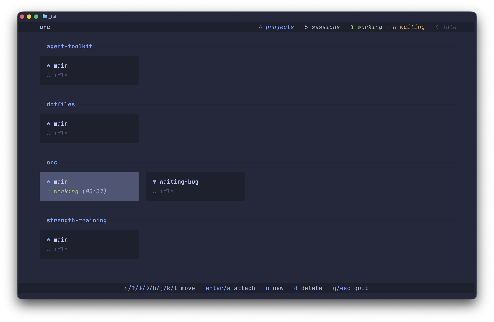

# Orc

[](LICENSE)



Orc is a TUI/CLI agent *orc*hestrator for running Claude Code agents in parallel without losing track
of them. Each session gets its own Git worktree and tmux session, so your agents work in isolation,
and you can see what every agent is doing right now from a convenient dashboard.

## Why Orc?

Running one AI coding agent in a project is easy. Running five is a mess. Without isolation they
overwrite each other's work. Without their own sessions they pile up in a tangle of terminal tabs.
And either way you lose track of which agent is working, which is waiting on you, and which is done.

Orc handles all of that. Spin up a new isolated session with a single command, jump between sessions
from one view, and see each agent's live status at a glance.

## Features

- 🖥️ **TUI:** Orc's interactive TUI lists every session across every project, with statuses,
  branches, and time since last activity. Switch, create, and delete sessions without leaving it.
- 🌳 **Isolated sessions:** Every session runs in its own Git worktree on its own branch with its own
  development environment. Agents never step on each other's files.
- 🚦 **Live agent status:** Orc reads Claude Code's hooks to show whether each session is working,
  waiting on you, or idle, so you know exactly which agent needs attention.
- ⌨️ **Scriptable CLI:** Every command is non-interactive, so the same operations the TUI exposes are
  available to shell aliases, scripts, and the agents themselves.

## Already Use These Tools?

Rather than reinventing the wheel, Orc combines several great tools into a simplified workflow:

- **[Git Worktrees](https://git-scm.com/docs/git-worktree):** Check out multiple branches of a
  repository at once, each in its own working directory.
- **[Tmux](https://github.com/tmux/tmux):** Run multiple terminal sessions inside one window, and
  keep them alive in the background.
- **[Tmuxinator](https://github.com/tmuxinator/tmuxinator):** Define and launch tmux window and pane
  layouts from a YAML config.

If you already use these tools, then Orc is for you—it ties them into a single workflow.

## Installation

Orc is not published to a package registry (yet). Install it from a clone of this repo:

1. Install [Bun](https://bun.sh), [tmux](https://github.com/tmux/tmux),
   [Tmuxinator](https://github.com/tmuxinator/tmuxinator), and [Git](https://git-scm.com).

2. Clone this repo and install dependencies:

   ```sh
   git clone https://github.com/LandonSchropp/orc.git
   cd orc
   bun install
   ```

3. Symlink the `orc` entrypoint into a directory on your `PATH` (e.g. `~/.local/bin`):

   ```sh
   ln -sf "$PWD/src/index.ts" ~/.local/bin/orc
   ```

4. Verify the install:

   ```sh
   orc --help
   ```

5. Register the status hook with Claude Code. Orc detects per-agent status by reading state files
   that Claude Code writes via hooks. Without this step, status detection silently does nothing.
   Add the following to either `~/.claude/settings.json` (global) or `.claude/settings.local.json`
   in a specific project:

   ```json
   {
     "hooks": {
       "UserPromptSubmit": [{ "hooks": [{ "type": "command", "command": "orc hook status" }] }],
       "Stop": [{ "hooks": [{ "type": "command", "command": "orc hook status" }] }],
       "Notification": [{ "hooks": [{ "type": "command", "command": "orc hook status" }] }]
     }
   }
   ```

   (A future release may package this as a Claude Code plugin so the manual step goes away.)

## Configuration

Orc reads optional settings from `$XDG_CONFIG_HOME/orc/settings.json` (defaulting to
`~/.config/orc/settings.json`).

- **`projectPaths`**: A list of globs pointing at local Git repositories to offer as projects
  alongside your Tmuxinator ones. Each match that contains a `.git` entry becomes a project named
  after its directory. A leading `~/` expands to your home directory.

  ```json
  {
    "projectPaths": ["~/Development/*"]
  }
  ```

  With the example above, every Git repository directly under `~/Development` appears in the TUI's
  project picker. These directory projects have no Tmuxinator config of their own, so they launch
  from your `default` Tmuxinator project with its root overridden. A repository that already has a
  Tmuxinator project at the same path is offered as that Tmuxinator project rather than duplicated,
  and paths that don't exist are ignored.

## How to Use

### Projects and Sessions

Orc operates at two levels:

- **Project**: An Orc project groups related sessions. It comes from either a Tmuxinator project or
  a local Git repository discovered under your configured [project paths](#configuration).
- **Session**: A tmux session spawned from a Tmuxinator project, paired with a Git worktree. The
  session named `main` runs directly on the project's main worktree, on its current branch. Every
  other session runs in its own linked worktree, isolated in a separate working directory on a
  branch named after the session.

### CLI

Orc can be driven _entirely_ from the CLI, which makes it easy for agents to control. Every
subcommand is non-interactive, so Orc also fits cleanly into shell aliases and scripts.

- `orc new <project> <session>`: Spawn the project's Tmuxinator template as a new session and
  attach. Name the session `main` to run on the project's main worktree; any other name gets a
  dedicated linked worktree.
- `orc list`: Plain-text list of sessions for piping into other tools or for checking state without
  entering the TUI.
- `orc switch <project> <session>`: Switch to a session by name.
- `orc detach`: Detach from the current Orc session.
- `orc delete <project> <session>`: Permanently delete the tmux session and worktree.

For details on commands and their options, run `orc <command> --help`.

### TUI

Orc features a fully interactive TUI that lets you browse and juggle sessions interactively. Run
`orc` with no subcommand to drop into a full-screen manager where you can switch between sessions,
see their statuses, and create and delete sessions.

- **Unified view across projects**: All Orc sessions in one scrollable list, grouped by Tmuxinator
  project, with session counts in the header.
- **Per-session status**: Each row surfaces whether the session is Working, Waiting, or Idle,
  alongside its Git branch and time since last pane output.
- **Inline lifecycle**: Create, attach, and delete sessions with single-key shortcuts. No need to
  drop back to the CLI.

## Contributing

Orc is a tool built to solve a specific problem, but issues and pull requests are welcome. Please
open an issue before a pull request if you have an idea for an improvement. See
[CONTRIBUTING.md](CONTRIBUTING.md) for setup, the checks to run, and the project's architecture and
conventions.

## License

[MIT](LICENSE).
